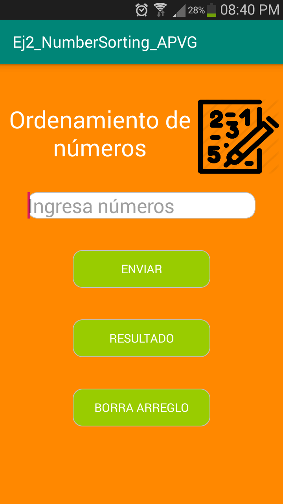
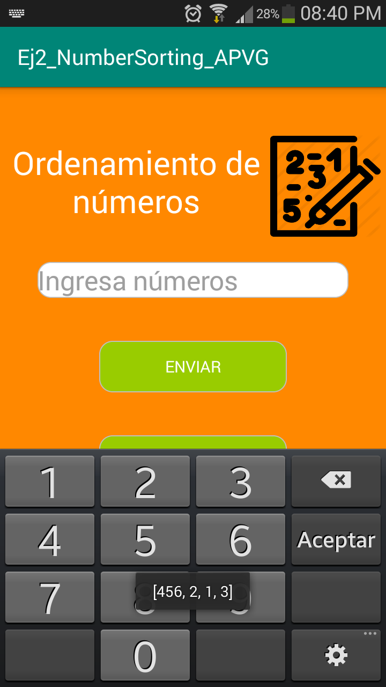
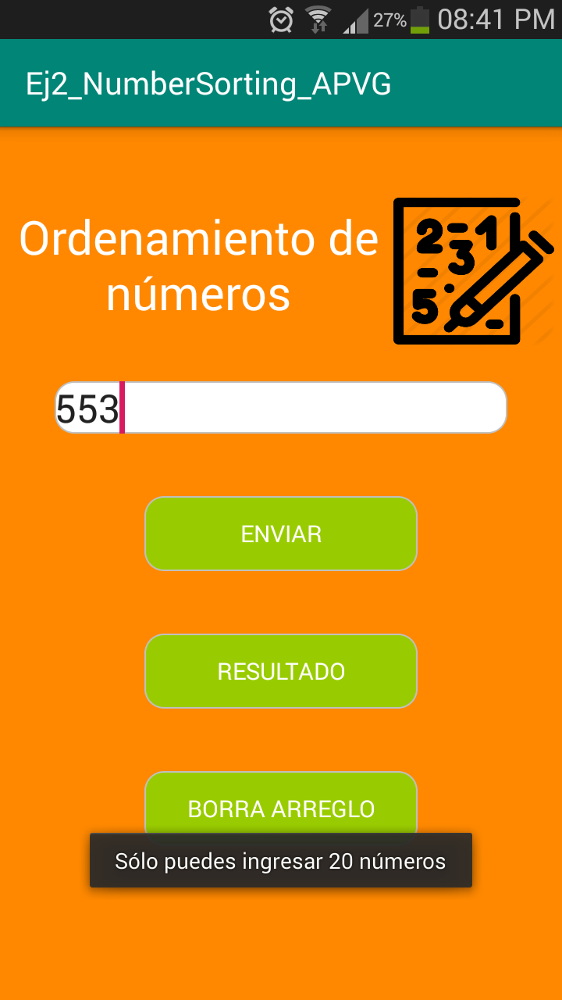
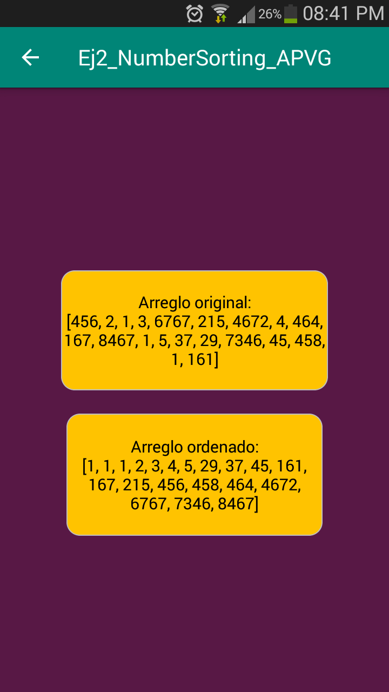

# Ej2_NS_APVG - Number Sorting - Aplicación que realiza el ordenamiento de números

Aplicación que permite al usuario agregar un máximo de 20 números (de 4 dígitos cada uno) a un arreglo, para ser ordenado.  Incluye soporte para lenguaje en español e inglés.

Para el ordenamiento, se emplea el algoritmo <u><b>bubble sort</b></u>.

La aplicación cuenta con dos activities:

*<b>Primera Activity</b> - La primera activity contiene una caja de texto que admite únicamente valores númericos, con un tamaño de 4 dígitos.
                            También contiene 3 botones: uno para enviar el número ingresado en la caja de texto, otro para visualizar el resultado del 
                             ordenamiento y un tercero para borrar el arreglo formado con los números ingresados y empezar con uno nuevo.
                             La adición de elementos al arreglo se hace uno por cada envío.
                             

Conforme el usuario ingresa valores al arreglo, éste le será mostrado con un mensaje Toast:

Una vez que se ha ingresado el máximo de elementos, se notifica al usuario del límite alcanzado.

*<b>Primera Activity</b> - La segunda activity muestra en dos bloques amarillos: el arreglo original ingresado y el arreglo resultante del ordenamiento con bubble sort.

*Ícono de la aplicación obtenido de: https://image.flaticon.com/icons/png/512/725/725247.png
